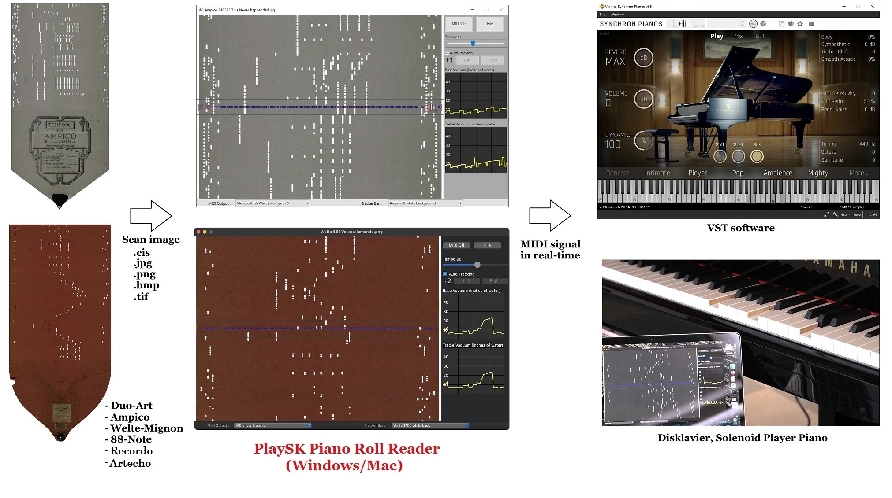
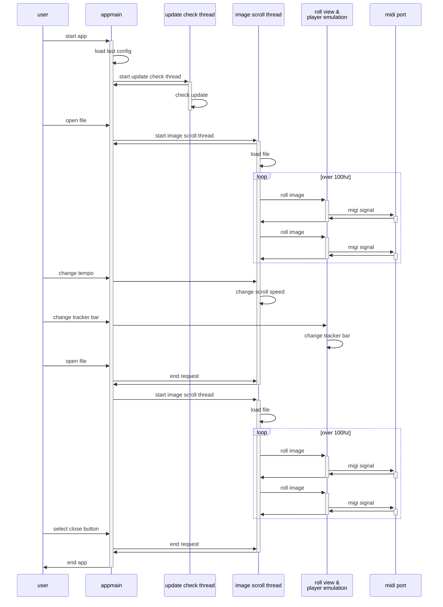

# PlaySK Piano Roll Reader Ver3.2

Optically reading a piano roll image, emulates expression and output midi signal in real-time.



The "virtual tracker bar" optically picks up roll holes then emulates note, pedal and expression.
Currently, 9 virtual tracker bars are available.
- Standard 88-note
- Ampico B
- Duo-Art
- Welte-Mignon Licensee
- Welte-Mignon T-100 (Red)
- Philipps Duca (no expression. experimental)
- Recordo version A / B
- Artecho

In the future, Ampico A, Welte T-98 will be supported.

Support image formats are `.cis`, `.jpg`, `.tif`, `.png`, `.bmp`. 

`.cis` supports various scanners such as stepper, wheel/shaft encoder, bi-color, twin-array.


## Demo

- Reading an Ampico B roll with Yamaha Disklavier  
    https://www.youtube.com/watch?v=ldwOIEc21QE

- Reading a Red Welte T-100 roll with Software Synthesizer  
    https://www.youtube.com/watch?v=WMEPW-UWhSU

## Usage

1. Download the software and sample scans
    https://github.com/nai-kon/PlaySK-Piano-Roll-Reader/releases/tag/Ver3.2
2. Launch the program and Select MIDI output port and Virtual tracker bar
3. Select scan image from `sample_scans` folder
4. Enjoy!


## Tips
* The program picks up lighted holes of image.
* Automatically set the tempo if the input filename has the tempo keyword (except .cis)
    * e.g.) `Ampico 52305 Clair de Lune tempo90.jpg` -> set the tempo to 90 automatically.
    * If no keyword is given, the default tempo is set. 98 for the Welte T-100 and 80 for the others.
* Associate the program with .cis on right-click menu, you can run app by double-clicking .cis file.
* The roll acceleration emulating is done by spool diameter and roll thickness.
* The roll scrolling direction is downward. So the Welte T-100 image should be inverted.

# For developers

## Requirements

* Python 3.11.6
* Poetry

Quick Start
```
$ poetry install
$ poetry shell
$ cd src/
$ python main.py
```

## Build binary locally

- Windows (x64)
    - `poetry run ./build_win.bat`
    - tested on Windows10
- macOS (x64/ARM)
    - `poetry run ./build_mac.sh`
    - tested on macOS Venture (both Intel and M1 cpu)


## CI/CD

There are test and release pipelines on Github Actions.
* PR or merge into main repository triggers unit tests.
* Push a tag triggers build binary and create a draft of the release. 
    * On Mac app, codesign, notarization, dmg installer creation are also triggered. (This uses my personal Apple Developer ID)

## Sequence diagram
