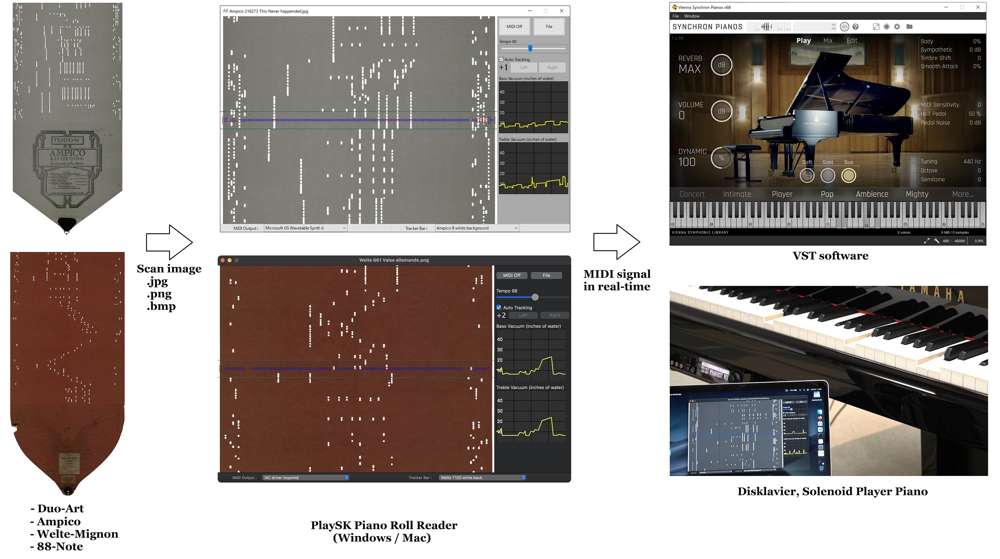

# PlaySK Piano Roll Reader Ver3.0

Optically reading a piano roll image, emulates expression and output midi signal in real-time.



The "virtual tracker bar" optically picks up the roll holes then emulates note, pedal and expression.
Currently, four "virtual tracker bar" are available.
- Standard 88-note
- Ampico B
- Duo-Art
- Welte-Mignon (Licensee, T-100)

I have a plan to support Ampico A, Recordo, Welte T-98 in the future.

## Usage

1. Download the software.
    https://github.com/nai-kon/PlaySK-Piano-Roll-Reader/releases/tag/Ver3.0

2. Launch the program and Select MIDI output and Virtual tracker bar
3. Select scan image from `sample_scans` folder
4. Enjoy!


## Tips
* The program picks up lighted holes.
* **The input image requires white padding on both roll edges.** (please refer to sample scans)
* The roll scrolling direction is downward. So the Welte T-100 image should be inverted.
* Ver3.0 only supports the scanned image. WebCam and .mp4 are not supported.
* Automatically set the tempo if the input filename has the tempo keyword (tempoXX)
    * e.g.) `Ampico 52305 Clair de Lune tempo90.jpg` -> set the tempo to 90 automatically.
    * If no keyword is given, the default tempo will be used. 98 for the Welte T-100 and 80 for the others.


# For developer

## Requirements
Developed with Python 3.9.13. 

Quick Start
```
$ pip install -r requirements.txt
$ cd src/
$ python main.py
```
We recommend to install packages on venv.

## Build binary

- Windows
    - `./build_win.bat`
    - tested on Windows10
- macOS
    - `./build_mac_x64.sh` `./build_mac_arm.sh`
    - tested on macOS Venture (both Intel and M1 cpu)

## Notes
* dark mode on Windows is not working due to the wxpython.
