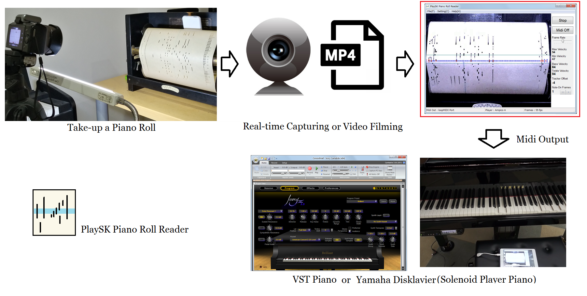
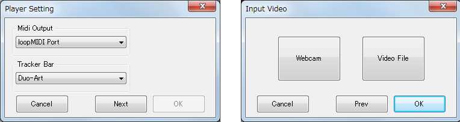

# PlaySK Piano Roll Reader       
### Optically Reading a Piano Roll Scroll, Converts to Midi.



- GitHub      
https://github.com/nai-kon/PlaySK-Piano-Roll-Reader

- Software Download Link  
https://drive.google.com/file/d/1yq7jKq54Z2azlLiP5jscRGhe1VcRFkRv/view


- [Demo] Reading Duo-Art roll with VST Piano   
https://www.youtube.com/watch?v=8lkMRsoG9cg
 

- [Demo] Reading Ampico A roll with Yamaha Disklavier     
https://www.youtube.com/watch?v=f7FEgWZceyU

This software reads piano roll scroll captured by Webcam or Video File. The Virtual Tracker Bar calculates brightness of each hole. The brightness will be darker if roll hole passes the tracker hole, it activates the note-on signal. 

The software is designed for "reading" a piano roll, not for "scanning or storage" a piano roll. If you are considering storage, hardware scanner such as "MK4 scanner" would be better. 

## Specific
- Virtual Tracker Bar   
    -Standard 88-note    
    -Duo-Art     
    -Ampico A

    Note: Song roll couldn't read well because of printed lyrics.

- Input     
    -Web Camera, for real-time reading         
    -Video File (over 60fps recommended)    

    Note: support only 640x480 resoluton

- Output    
    -Midi signal to selected midi device    
    e.x. Yamaha Disklavier, Piano VST (Ivory serires)
    
## Code Layout
The code is written in C/C++ Win32API, OpenCV without GUI Framework.  
I know should rewrite by using GUI Framework such as .Net, but no time for it.

My Build Environment    
-Windows 10 64bit    
-Visual Studio 2017     
-VC++2013, 2015 Runtime       
-OpenCV 2.4.9

- \src   
main.cpp - main souce. UI control, emulating thread       
cvhelper.cpp - convert opencv image to device context   
json11.cpp - json parser
player.cpp - 88-note player class(base class)       
DuoArt.cpp - Duo-Art player class     
AmpicoA.cpp - Ampico A player class

- \config       
Setting.json - global setting of the software   
88_tracker.json     
AmpicoA_tracker.json    
Duo-Art_tracker.json    

- \lib_opencv_249     
Contains OpenCV header/lib/binary

- \bin     
Built software binaries will be output to here.

- PostBuildEvent.bat      
Copy ConfigFile and OpenCV binary to Output Folder, after building.


## How to Play

### 1. Select Midi-Out and TrackerBar, Video Source

Run PlaySK Piano Roll Reader.exe.

    
- Player Setting      
Select Midi-Out Device and Virtual Tracker Bar.

- Input Video     
-Webcam Input - Click "Webcab" and "OK"      
-VideoFile Input - Click "Video File" and select a video file.      

The default webcam device number is "0".     
For changing, modify the "Setting.json"      
```json
"device": {
    "webcam_devno": 0
}
```
### 2. Start Reading and Emulating

  
Click "Play" for Emulating.     

### Adjust the Tracker Hole Position    
Hole positions are written on tracker.json at ConfigFile directory.     
The "x" position indicates left side of each tracker hole.
```json
"tracker_holes": {
    "note": {
        "x": [
            48,
            54,
            60,
            66,
            ,
            ,
```

