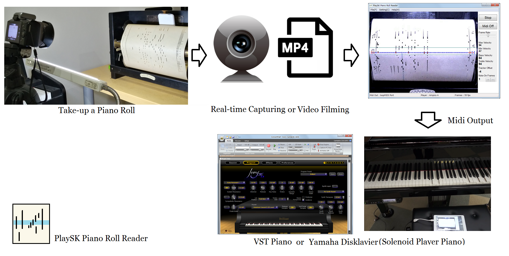
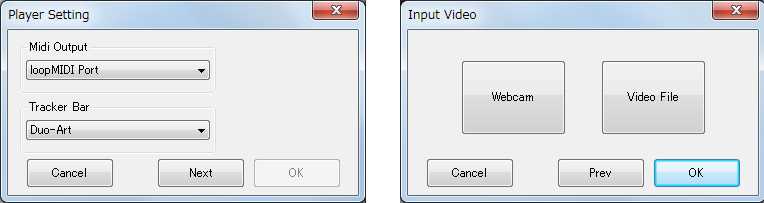
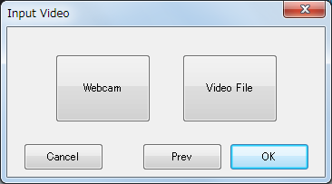
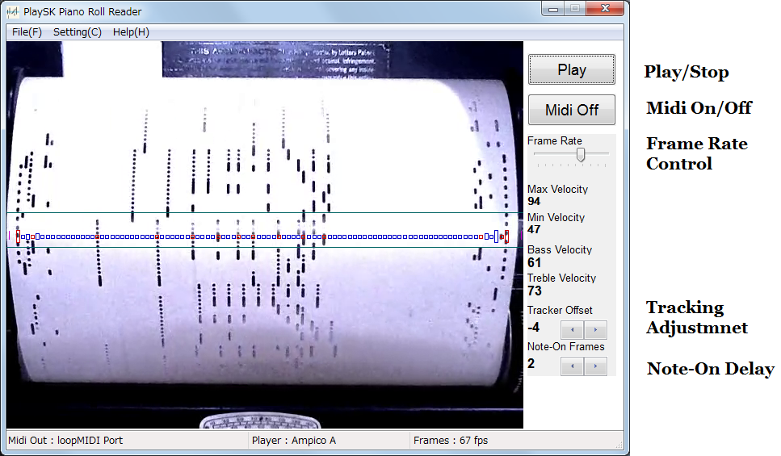

# PlaySK Piano Roll Reader       
### Optically Reading a Piano Roll Scroll, Converts to Midi.

- Software Download Link  
https://drive.google.com/open?id=1xjnaYY91dv60dnxy_YtYg6kc_XFoWOFv

- [DemoVideo] Reading a Duo-Art roll with VST Piano   
https://www.youtube.com/watch?v=qQDl1Rn39J0
 

- [DemoVideo] Reading an Ampico A roll with Yamaha Disklavier
https://www.youtube.com/watch?v=UzccJrikBEE

This software reads piano roll scroll captured by Webcam or Video File. The Virtual Tracker Bar calculates brightness of each hole. The brightness will be darker if roll hole passes the tracker hole, it activates the note-on signal. 

The software is designed for "reading" a piano roll, not for "scanning or storage" a piano roll. If you are considering storage, hardware scanner such as SaMK4 scanner would be better. 

## Specific
- Virtual Tracker Bar   
    -Standard 88-note    
    -Duo-Art     
    -Ampico A

    Note: Song Roll couldn't read well because of printed lyrics.

- Input     
    -WebCam  (640x480, for real-time reading)    
    -Video File (640x480, over 60fps recommended)

- Output    
    -Midi Signal to Selected Midi Device    
    e.x. Yamaha Disklavier, Piano VST (Ivory serires)
    
- Roll Tracking     
    -Manual Tracking (WebCam, VideoFile Input)   
    -Tracking Save function (VideoFile Input)     
     This function is save the manual tracking operation. It tracks roll automatically after recoding the manual tracking.

## Code Layout
The code is written in C/C++ Win32API, OpenCV.  
I know should rewrite by using GUI Framework such as .Net, but no time for it.

- \ConfigFile     
88-Note.txt - 88-note tracker hole position.     
Duo-Art.txt - Duo-Art tracker hole position, velocity file.
Ampico_A.txt - Ampico A tracker hole position, velocity file.       
Setting.ini - Global setting of the Software

- \MyReader   
MyReader.cpp - main souce. UI control, reading thread       
mycv.cpp - convert opencv image to device context   
player.cpp - 88-note player class(base class)       
DuoArt.cpp - Duo-Art player class     
AmpicoA.cpp - Ampico A player class

Build Environment     
-Visual Studio 2017      
-OpenCV 2.4.8 

## How to Play

### 1. Select Midi-Out and Player, Video Source

Run PlaySK Piano Roll Reader.exe.

    
Select Midi-Out Device and Virtual Tracker Bar.

  
- Webcam Input - Click "Webcab" and "OK"
- VideoFile Input - Click "Video File" and select a video file.

At Webcam Input, device no of wecam is set "0".     
For changing, modify the WebCamDevNo item of "Setting.ini"

### 2. Start Midi Emulating

  
Click "Play" for Emulating.     

- Adjust Tracker Hole Position    
The hole position are written on player file (88-Note.txt, Ampico_A.txt, Duo-Art.txt)
You can simplly modify note position(pixel unit). 

- Semi Automatic Tracking (Tracking Save)
