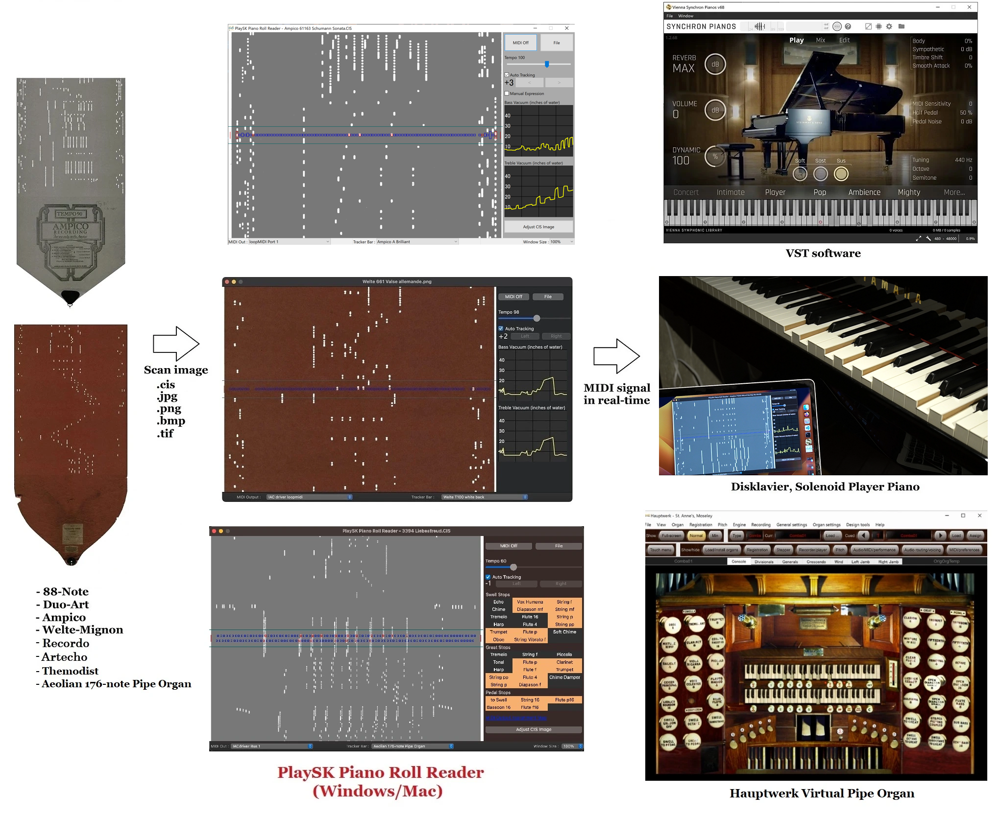

# PlaySK Piano Roll Reader Ver3.6

Optically reading a piano roll image, emulates expression and output midi signal in real-time.



The "Virtual Tracker Bar" optically picks up roll holes then emulates note, pedal and expression code. The expression code is decoded to vacuum level (in inches of water) in real-time, then convert to MIDI velocity.

Currently, 9 virtual tracker bars are available.
- Aeolian 176-note Duo-Art Pipe Organ ([MIDI output assignment](https://playsk-aeolian176note-midi-assignment.pages.dev/))
- Standard 88-note
- Ampico B
- Duo-Art
- Welte-Mignon T-100 (Red) / T-98 (Green) / Licensee
- Philipps Duca (no expression. experimental)
- Recordo version A / B
- Artecho
- Themodist
    - `Themodist e-Valve` supports e-valve midi note output. (18 for sustain, 19 for bass snakebite, 109 for treble snakebite)

In the future, Ampico A will be supported.

Support image formats are `.CIS`, `.jpg`, `.tif`, `.png`, `.bmp`. The `.CIS` supports various scanners such as stepper, wheel/shaft encoder, bi-color, twin-array.

## Demo

- Reading an Ampico B roll with Yamaha Disklavier  
    https://www.youtube.com/watch?v=9f9J4TRmr5Y

- Reading a Red Welte T-100 roll with Software Synthesizer  
    https://www.youtube.com/watch?v=WMEPW-UWhSU

- Reading an Aeolian 176-note Pipe Organ roll with Hauptwerk virtual organ
    https://www.youtube.com/watch?v=N0Gm2g1ADjk

## Donation

I personally pay near $100 a year to codesign and notarize software for distribution. Your support greatly contributes to the continuous development and improvement of the Software. Please consider donating.

https://www.paypal.com/paypalme/KatzSasaki

## Usage

1. Download the software and sample scans
    https://github.com/nai-kon/PlaySK-Piano-Roll-Reader/releases/
2. Launch the program and Select MIDI output port and Virtual tracker bar
3. Select scan image from `sample_scans` folder
4. Enjoy!


## Manual Expression

If you check `☑ Manual Expression`, you can express dynamics using the keyboard.
* `J`, `K`, `L`: intensity level (can be combined)
* `A`, `S`: bass and treble accent


## Tips
* The program picks up lighted holes of image.
* The vacuum level is emulated in inches of water and later converted to MIDI velocity.
* The roll acceleration is emulated by spool diameter and roll thickness.
* The roll tempo is automatically set.
    * CIS images... from CIS header.
    * Other images... from .ANN file if exists. Or from filename such as `Ampico 52305 Clair de Lune tempoXX.jpg`.
* Associate the program with .CIS on right-click menu, you can run app by double-clicking .CIS file.
* The roll scrolling direction is always downward. So the Welte T-100 image should be inverted.

# For developers

## Requirements

* Python 3.11.6
* Poetry

Quick Start
```
$ poetry install
$ poetry shell
$ cd src/
$ python main.py
```

## Build binary locally

- Windows (x64)
    - `poetry run ./build_win.bat`
    - tested on Windows10
- macOS (x64/ARM)
    - `poetry run ./build_mac.sh`
    - tested on macOS Venture (both Intel and M1 cpu)


## CI/CD

There are test and release pipelines on Github Actions.
* PR or merge into main repository triggers unit tests.
* Push a tag triggers build binary and create a draft of the release. 
    * On Mac app, codesign, notarization, dmg installer creation are also triggered. (This uses my personal Apple Developer ID)

## Sequence diagram
